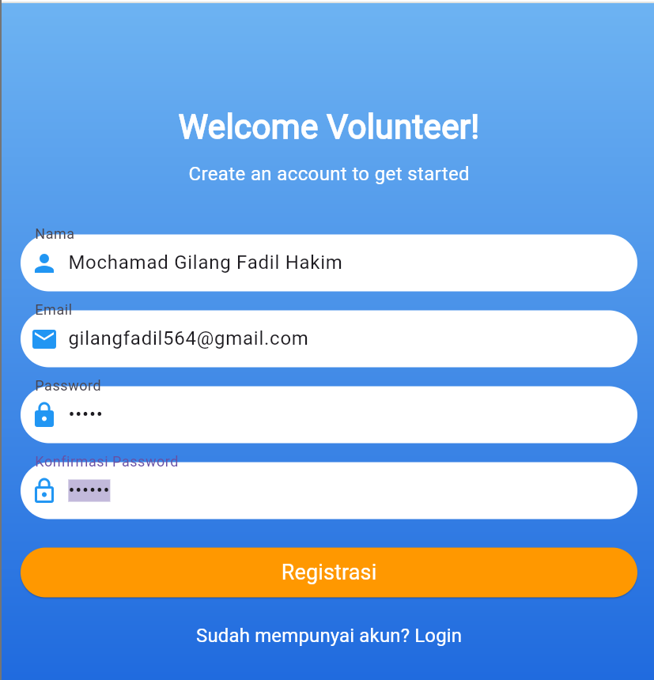
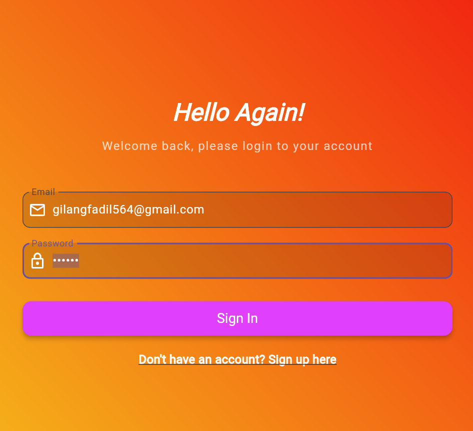
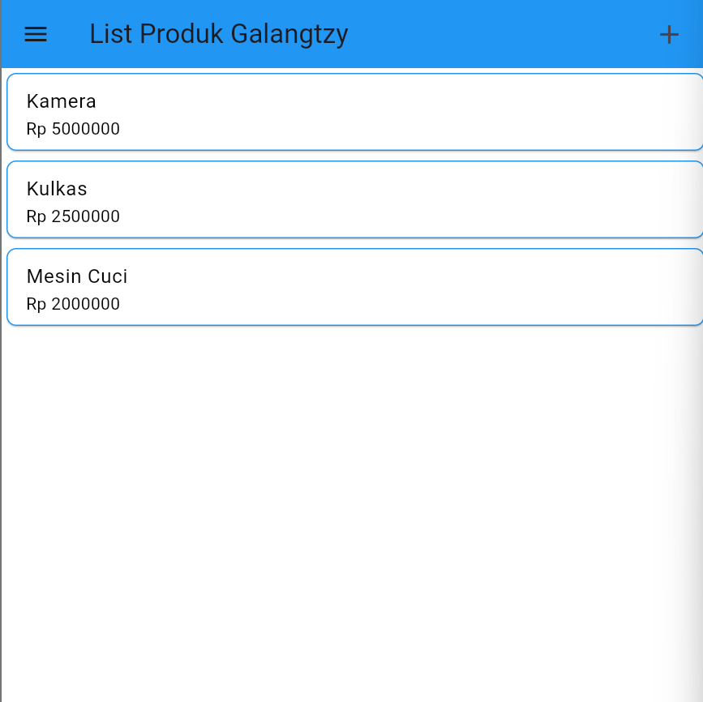
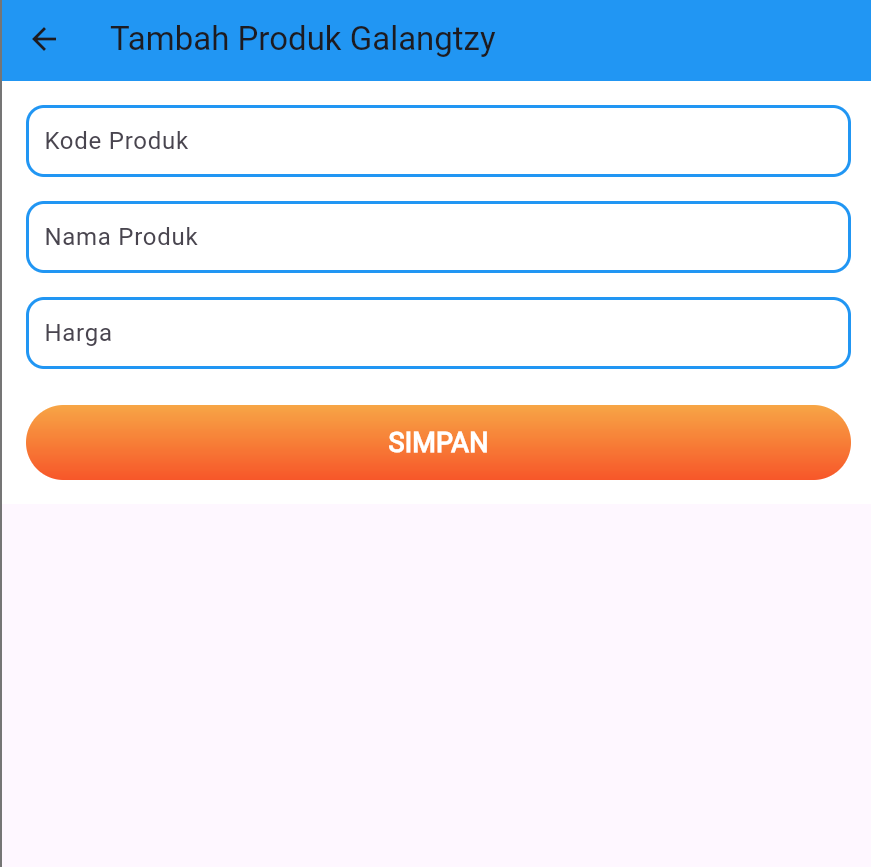
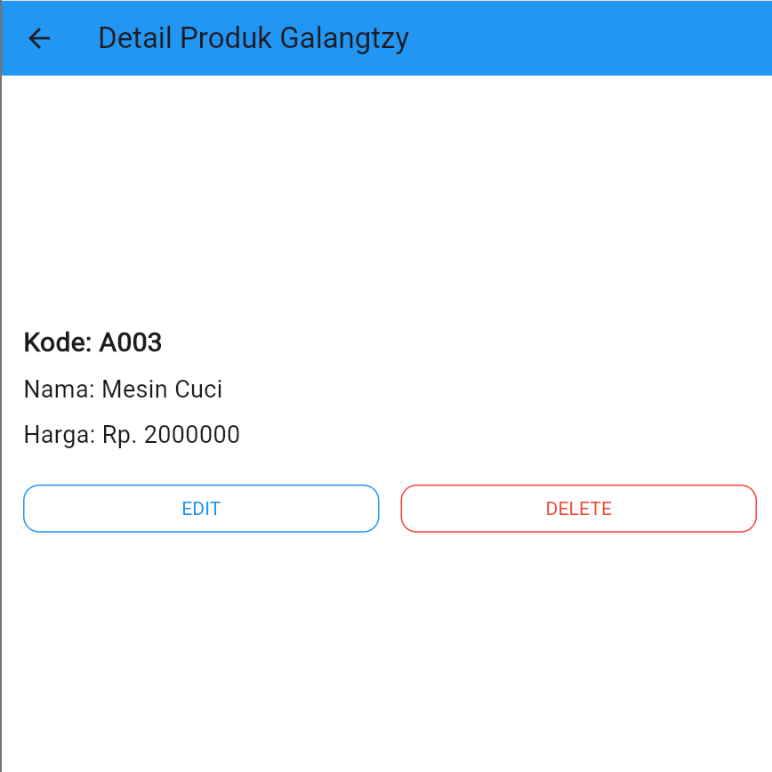
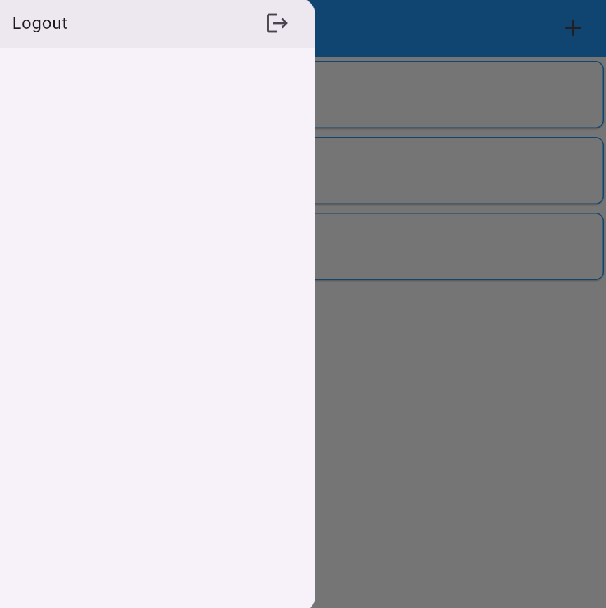

Selesaikan kode pada pertemuan 4 hingga UI nya selesai, kemudian tambahkan nama panggilan kalian pada setiap action bar misal : Tambah Produk Bisma, List Produk Bisma, Detail Produk Bisma, dll. Screenshot semua halaman UI yang sudah terbentuk dan masukkan ke file Readme.

NB : Buat repository baru untuk pertemuan 4, eg: LabMobile4_Nama_ShiftBaru

Hal yang perlu dikumpulkan : Link Repo berisi Source Code Readme.md yang berisi SS tampilan aplikasi Anda.

Nama : Mochamad Gilang Fadil Hakim

NIM : H1D022082

Shift Baru: B
# tokokita

## Screenshot

